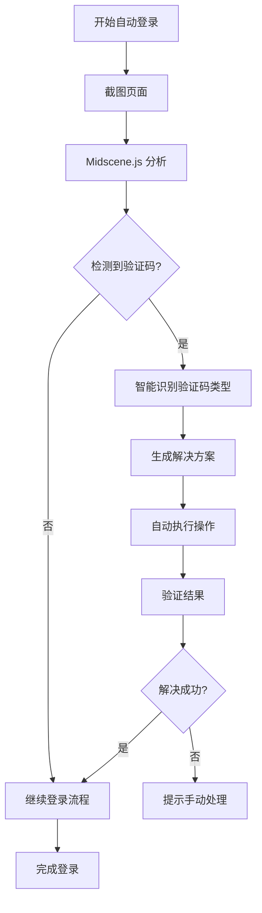

# Midscene.js 智能验证码识别集成

## 🎯 概述

本项目已集成 Midscene.js MCP 服务，提供智能验证码识别和自动解决功能，大大提升自动登录的成功率。

## 🚀 功能特点

### **智能验证码识别**
- 🔍 **多类型支持**：文字、图片、滑动、点击、拼图验证码
- 🤖 **AI 驱动**：基于视觉理解的智能识别
- 🎯 **高准确率**：置信度评分和智能回退机制
- ⚡ **自动解决**：支持自动填写和操作验证码

### **智能页面分析**
- 📊 **元素识别**：自动识别登录表单元素
- 🔧 **选择器优化**：智能生成最佳选择器
- 📈 **成功率分析**：登录成功率统计和优化建议

## 🛠️ 安装配置

### **1. 安装依赖**

```bash
# 安装 Midscene.js CLI
npm install @midscene/cli

# 安装 MCP SDK
npm install @modelcontextprotocol/sdk
```

### **2. 获取 API 密钥**

1. 访问 [Midscene.js 官网](https://midscene.js.org)
2. 注册账号并获取 API 密钥
3. 在 `.env.local` 中配置：

```env
MIDSCENE_API_KEY=your_midscene_api_key_here
```

### **3. 启动 Midscene MCP 服务器**

```bash
# 启动 MCP 服务器
npx @midscene/cli mcp-server

# 或者在后台运行
npx @midscene/cli mcp-server --daemon
```

## 🎮 使用方法

### **自动集成**

Midscene.js 已自动集成到增强自动登录功能中：

1. **环境管理页面**：点击"启动测试"时自动使用
2. **调试工具页面**：在"增强自动登录测试"中使用
3. **API 调用**：通过 `/api/enhanced-auto-login` 使用

### **工作流程**



### **支持的验证码类型**

| 类型 | 描述 | 自动解决 | 置信度要求 |
|------|------|----------|------------|
| 文字验证码 | 数字/字母组合 | ✅ | > 0.8 |
| 图片验证码 | 选择特定图片 | ✅ | > 0.7 |
| 滑动验证码 | 滑块拖拽 | ✅ | > 0.8 |
| 点击验证码 | 点击特定位置 | ✅ | > 0.7 |
| 拼图验证码 | 拖拽拼图块 | ✅ | > 0.8 |

## 📊 智能分析功能

### **页面元素分析**

```javascript
// 自动识别登录元素
const analysis = await midsceneClient.analyzeLoginPage(screenshot, pageUrl);

console.log(analysis.loginElements);
// {
//   username: [{ selector: '#username', confidence: 0.95 }],
//   password: [{ selector: '#password', confidence: 0.98 }],
//   submitButton: [{ selector: '.login-btn', confidence: 0.92 }]
// }
```

### **验证码智能识别**

```javascript
// 分析验证码
const captchaResult = await midsceneClient.analyzeCaptcha(screenshot);

console.log(captchaResult);
// {
//   type: 'slider',
//   confidence: 0.89,
//   elements: [...],
//   suggestedActions: [...]
// }
```

### **自动解决方案**

```javascript
// 获取解决方案
const solution = await midsceneClient.solveCaptcha(screenshot, 'slider');

console.log(solution);
// {
//   solution: 'drag_slider',
//   confidence: 0.91,
//   steps: [
//     { action: 'drag', target: '.slider-handle', value: '200,0' }
//   ]
// }
```

## ⚙️ 配置选项

### **置信度阈值**

```javascript
// midscene.config.js
module.exports = {
  captcha: {
    confidenceThreshold: 0.7,  // 识别阈值
    solveThreshold: 0.8,       // 解决阈值
  }
};
```

### **超时设置**

```javascript
timeout: {
  analysis: 30000,    // 分析超时 30秒
  solve: 60000,       // 解决超时 60秒
  verify: 30000,      // 验证超时 30秒
}
```

### **重试机制**

```javascript
retry: {
  maxAttempts: 3,     // 最大重试次数
  delay: 2000,        // 重试延迟
}
```

## 🔧 高级功能

### **自定义验证码处理**

```javascript
// 扩展验证码类型
const customCaptchaHandler = {
  type: 'custom_slider',
  analyze: async (screenshot) => { /* 自定义分析逻辑 */ },
  solve: async (analysis) => { /* 自定义解决逻辑 */ }
};
```

### **批量验证码处理**

```javascript
// 批量处理多个网站的验证码
const batchResult = await processBatchCaptcha([
  { siteId: 'site1', screenshot: 'path1.png' },
  { siteId: 'site2', screenshot: 'path2.png' }
]);
```

## 📈 性能优化

### **缓存机制**

- ✅ **分析结果缓存**：相同页面结构复用分析结果
- ✅ **模型缓存**：本地缓存常用识别模型
- ✅ **解决方案缓存**：缓存成功的解决方案

### **智能回退**

```javascript
// 自动回退到传统方法
if (midsceneConfidence < 0.7) {
  return await fallbackCaptchaDetection();
}
```

## 🐛 故障排除

### **常见问题**

1. **API 密钥无效**
   ```bash
   # 检查密钥配置
   echo $MIDSCENE_API_KEY
   ```

2. **MCP 服务器连接失败**
   ```bash
   # 检查服务器状态
   npx @midscene/cli status
   ```

3. **验证码识别失败**
   ```bash
   # 查看详细日志
   tail -f .browser-sessions/logs/midscene.log
   ```

### **调试模式**

```javascript
// 启用详细日志
process.env.MIDSCENE_DEBUG = 'true';
```

## 📊 监控和分析

### **成功率统计**

- 📈 **验证码识别成功率**
- 📈 **自动解决成功率**  
- 📈 **整体登录成功率提升**

### **性能指标**

- ⏱️ **平均识别时间**
- ⏱️ **平均解决时间**
- 💾 **API 调用次数**

## 🚀 未来规划

- 🔮 **更多验证码类型支持**
- 🤖 **自学习能力**
- 🌐 **多语言支持**
- 📱 **移动端适配**

## 🤝 贡献

欢迎提交 Issue 和 Pull Request 来改进 Midscene.js 集成功能！

---

**注意**：Midscene.js 是一个付费服务，请根据使用量选择合适的套餐。免费套餐通常包含一定的 API 调用次数。
